# Cornix 日本語マニュアル

> Source: https://docs.channel.io/jezailfunderjp/ja/articles/Cornix-%E6%97%A5%E6%9C%AC%E8%AA%9E%E3%83%9E%E3%83%8B%E3%83%A5%E3%82%A2%E3%83%AB-c1160246
> Retrieved: 2026-05-24
> Note: 出典は鍵造坊（JezailFunder）公式マニュアル。記述は出荷時 RMK ファームウェア（Vial 前提）に基づく。本フォーク（cornix-zmk-custom）は ZMK 化のため、Vial 関連手順・「Switch Output」「Clear Peer」等のキーマップ操作はそのまま当てはまらない。ハードウェア仕様・充電・LED・ペアリング動作の参照用として残す。

## Cornixワイヤレス分割型キーボード

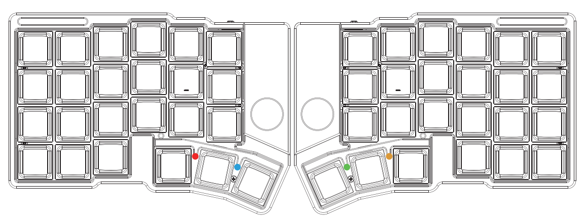

Cornixは、鍵造坊（JezailFunder）によって開発された完全ワイヤレス分割型エルゴノミクスキーボードです。

### 主な特長

- **完全ワイヤレス分割設計** - 左右のユニット間および本体と主要通信モジュール間はすべてワイヤレスで接続
- **デュアルモード接続** - Bluetooth接続およびUSB有線接続の2つの接続方式に対応
- **高度なカスタマイズ機能** - マクロ、ホームポジション修飾キー、コンボなどをサポート
- **RGBインジケーター** - 左右それぞれに2つのRGBインジケーターを搭載

## 充電

左手側の電源スイッチを「左側」に倒すとオン、「右側」に倒すとオフになります。使用時および充電時には両方のユニットの電源をオンにしてください。

高速充電器や高出力アダプタの使用は故障の原因となるため、可能な限りPCから充電してください。満充電後はケーブルを抜き、長時間つなぎっぱなしでの充電は避けてください。

v1.11ファームウェアより電源まわりの保護処理が強化されています。ファームウェアバージョンはVial画面の「Keyboard Layout」で確認できます。

## インジケーターライト

### 左手側

**左側ライト（Bluetoothインジケーター）** - Bluetooth接続状態を表示
- 緑/赤/青の色がそれぞれBluetoothチャンネル0/1/2に対応
- ゆっくり点滅：Bluetoothデバイス検索中
- 一度点灯後消灯：Bluetooth接続完了

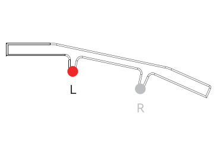

**右側ライト（ユニット接続・バッテリーインジケーター）** - 左右ユニットの接続状態およびバッテリー状態を表示
- 赤色点滅：バッテリー残量少ない
- 緑色ゆっくり点滅：充電中
- 緑色点灯後消灯：充電完了
- 青色ゆっくり点滅：右手ユニットとの接続が失われている

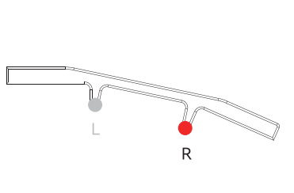

### 右手側

**左側ライト（バッテリーインジケーター）** - デバイスのバッテリー状態を表示
- 赤色点滅：バッテリー残量少ない
- 緑色ゆっくり点滅：充電中
- 緑色点灯後消灯：充電完了

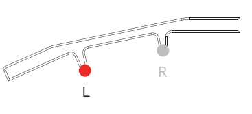

**右側ライト（左右ユニット接続インジケーター）** - 右手ユニットと左手ユニットの接続状態を表示
- 青色ゆっくり点滅：左手ユニットとの接続が失われている
- 青色点灯後消灯：左手ユニットとの接続成功

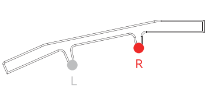

## キーリマップ変更

Cornixは有線モード・無線モード両方でVialによるキーマップ変更に対応しています。

### 初期キーマップ

cornix-default-keymap.vil（8.6KB）ファイルをVialアプリ版で「File → Load saved layout」で読み込むことができます。

### キーマップ変更手順

**1. Vialサイトを開く**
https://vial.rocks にアクセスします。

**2. デバイスを選択して接続する**
- 「Start Vial」をクリック
- ポップアップから「Cornix」（有線モード）またはmacOSではConrix-ペア設定済み、Windowsでは不明なデバイス（0000:0000）（無線モード）を選択し「接続」をクリック

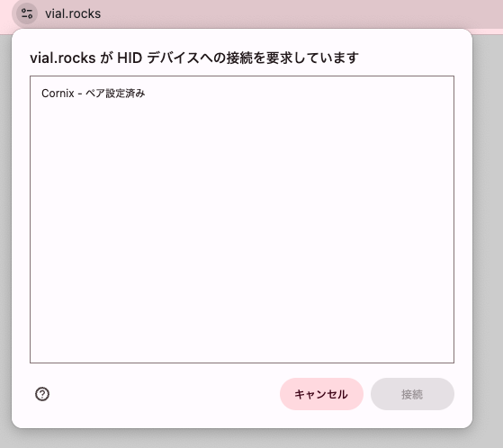

無線モードでのキーマップ変更は電波干渉により接続エラーが発生する場合があります。接続に失敗した場合は再度接続を試すか、有線モードへ切り替えてください。

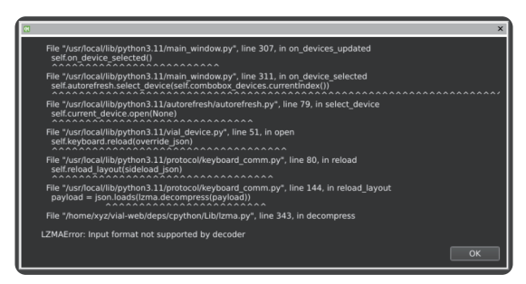

**3. キーマップをカスタマイズする**
接続完了後、設定画面でキーマップを自由にカスタマイズできます。

## 接続方法

Cornixは最大3台のBluetoothデバイスを登録・切り替えて使用でき、有線USB接続にも対応しています。

### USB接続（有線モード）

左手ユニットをUSBケーブルでPCまたは他のデバイスに接続するとUSB有線モードで動作します。

### Bluetooth接続（無線モード）

最大3台のBluetoothデバイス（BT0/BT1/BT2）に対応しており以下の方法で切り替えられます：
- Vialの「User」タブでBT0/BT1/BT2を任意のキーに割り当てて切り替え
- 初期設定ではMO(3)に割り当てられたキーを押しながらCaps/Shift/Ctrlを押すことで切り替え

### 接続優先モードについて

Cornixには2種類の接続優先モードがあります。初期設定はUSB優先モードです。

**USB優先モード** - 左手ユニットがPC とUSBケーブルで接続されている場合、自動的にUSBモードへ切り替わりBluetooth接続は無効になります。

**Bluetooth優先モード** - 左手ユニットがPCとBluetooth接続されている場合、Cornixはそれを優先します。USBケーブル接続時は充電のみが行われ、接続済みデバイスがない場合のみUSB有線接続が有効になります。

### 接続優先モードの切り替え方法

Vialの「User」タブで「Switch Output」を任意のキーに割り当てることで、USB優先/Bluetooth優先を簡単に切り替えられます。

## デバイスのスリープ

Cornixは一定時間操作が行われない場合、自動的にスリープ状態へ移行します。

### 接続済みデバイスがある場合

Bluetoothデバイスと接続されている状態でスリープに入った場合、スリープ中もBluetooth接続は維持され、復帰後もキー入力が失われることはありません。

### ペアリング待機状態（ブロードキャスト状態）の場合

ペアリング待機状態でスリープに入った場合、復帰には任意のキーを押す必要があります。復帰後、Bluetoothデバイス側からCornixを再度検索・接続できるようになります。

### 自動ペアリング

- 初回起動時、左右ユニットは自動的にペアリングされます
- 手動での設定は不要
- 一度ペアリングに成功すると、以降は電源を入れるたびに自動で再接続されます

### ペアリング解除

**1. Vialを開く** - Vialを起動し「User」タブに移動

**2. キーを割り当てる** - 任意のキーに「Clear Peer」を割り当て

**3. ペアリングを解除する** - 割り当てた「Clear Peer」キーを8秒以上長押し

**4. 再起動** - 自動再ペアリングを防ぐため以下を実行
- USBを解除
- 電源をオフ
- 3秒待ってから再度電源をオン

### 再ペアリング

再起動後、ペアリングが解除された左右ユニットは起動時に自動で検索モードへ入り、自動的に再ペアリングされます。

## ファームウェア更新

Cornixはユーザー自身でのファームウェア更新に対応しており、継続的に機能がアップデートされています。

### 重要な注意事項

- 左右キーボードで両方更新する必要があります
- バージョンをまたぐアップデートを行うと既存のキーリマップ設定が消去されます。更新前に現在のレイアウトをエクスポートしてバックアップし、更新後に再インポートしてください

### キーマップ設定のバックアップについて

ファームウェアを更新するとすべてのキーマップ設定が初期化されます。

**バックアップ方法** - Vialで「File → Save current layout」を選択して現在のキーレイアウトを保存

**復元方法** - 更新後「File → Load saved layout」を選択することで以前のキーマップ設定を読み込めます

### 更新前の準備

**1. Bluetoothペアリングの解除** - パソコンのBluetooth設定画面からCornixのペアリングを事前に解除してください。ファームウェア更新を行うとすべてのペアリング情報がリセットされるため、更新前にPC側のペアリング情報を削除する必要があります。

**2. ファームウェアとツールの準備**
- 最新のCornixファームウェア（左手用/右手用をそれぞれPC に保存）
- ピンセットやSIMピンなどの細いツール

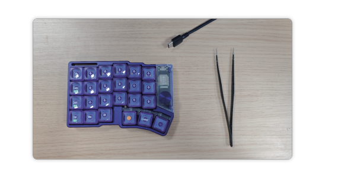

### ファームウェア更新手順

**ブートモードに入る**
1. キーボードをUSBケーブルでPCに接続
2. ピンセット等を使いリセットボタンをすばやく2回押す
3. PC上に「Cornix」あるいは「NO NAME」という名前のUSBドライブが表示されます

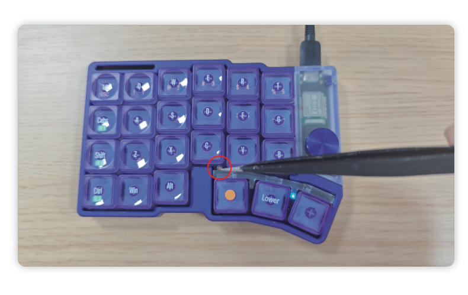

左右キーボードそれぞれで同じ操作を行ってください。

**ファームウェアを書き込む**

事前に準備したUF2ファイルを表示されたUSBドライブへドラッグ&ドロップしてください。
- 左手ユニット用：`left`
- 右手ユニット用：`right`

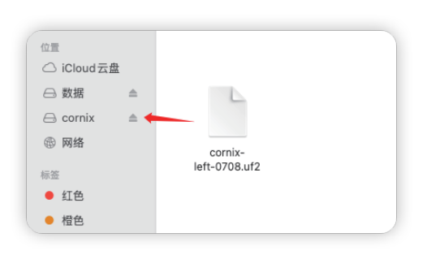

コピーが完了するとファームウェアの書き込みも完了となります。

ファームウェア更新時、ファイル転送やディスクの取り出しに関するエラーが表示される場合がありますが、キーボードの再起動による一時的な挙動のため、通常は無視して問題ありません。

アップデート完了後、VialのLayoutタブでバージョンを確認できます。

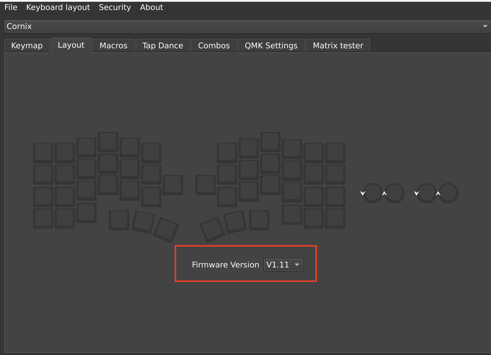

**再ペアリング**

左右両方のキーボードで同様の操作を行うと、自動的に再ペアリングが実行されます。特別な操作は不要です。
